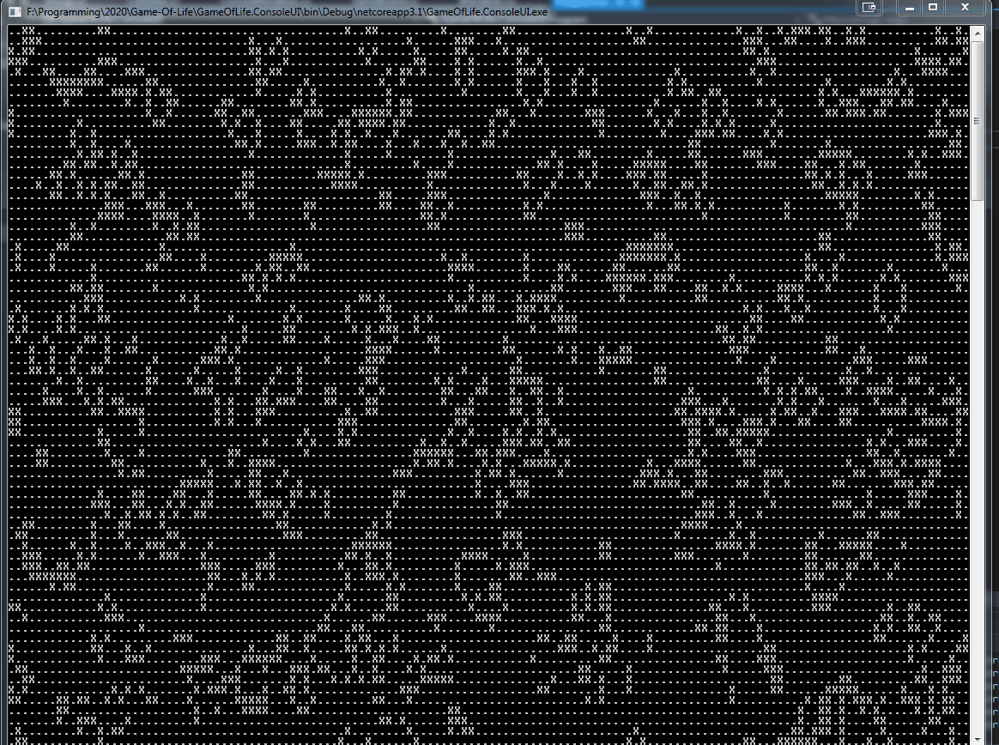
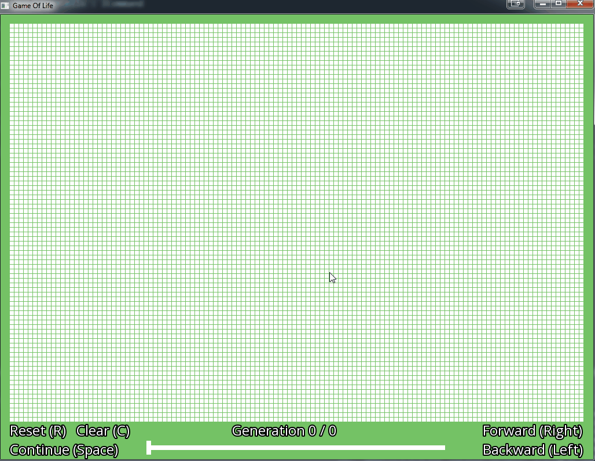

# Game-Of-Life
 

## Motivation

The motivation behind this project was to honor the late John Conway.  
I used the opportunity in the SFML project to get familiar with the [Command design pattern](https://gameprogrammingpatterns.com/command.html).

## Console

The console project is the barebone version. It generates random cells at the start and mutates them every 0.25 seconds until the program closes.

  

## SFML

The SFML project is more fleshed out than the console project.
The user can go back and forth between generations with the arrow keys and draw on the board with the mouse.

  

